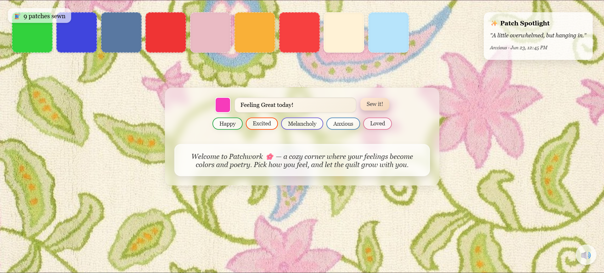

# 🌸 Patchwork: A Collaborative Emotional Quilt

Patchwork is a soothing digital space where people anonymously “sew” their emotions into a shared quilt using colored patches and AI-generated affirmations. It’s a calming, communal art experience powered by Python, Flask, WebSockets, and a sprinkle of emotional AI.



---

## ✨ Features

- 🎨 Pick a color that reflects your current emotion
- 🧵 Sew a message patch into a live, evolving digital quilt
- 🤖 Get a comforting affirmation generated by AI (Cohere API)
- 🌐 See others’ patches update in real time (WebSockets)
- 🔁 Persistent quilt using SQLite
- 🎵 Ambient background music toggle
- ⏰ Timestamp on each patch
- 🔢 Patch counter

---

## 🚀 Live Demo
You can try the project here: [🌸 Patchwork](https://patchwork-ondo.onrender.com)

Feel free to explore the quilt, share a feeling, and see what the AI has to say! 🌸

---

## 🛠️ Tech Stack

| Layer      | Tech Used                     |
|------------|-------------------------------|
| Backend    | Flask + Flask-SocketIO        |
| Realtime   | WebSockets (Socket.IO)        |
| Database   | SQLite + SQLAlchemy           |
| AI         | [Cohere](https://cohere.com) (Command R model) |
| Frontend   | HTML, CSS, JavaScript         |
| Visuals    | Flexbox + responsive layout   |

---

## 📦 Local Setup

### 1. Clone the repo

```bash
git clone https://github.com/your-username/patchwork.git
cd patchwork
```

### 2. Set up a virtual environment

```bash
python3 -m venv venv
source venv/bin/activate  # or venv\Scripts\activate on Windows
```

### 3. Install dependencies

```bash
pip install -r requirements.txt
```

### 4. Set your Cohere API key

Create a .env file. You can use other AI APIs too (like OpenAi, Claude, etc.) 
```env
COHERE_API_KEY=your-cohere-key-here
```

### 5. Run the app in terminal & Visit Local Host

```bash
python backend/app.py
````

---

## 📂 Folder Structure

```csharp
patchwork/
├── backend/
│   ├── app.py              # Flask app
│   ├── cohere_utils.py     # AI integration
│   └── patches.db          # SQLite DB
├── static/
│   ├── styles.css          # CSS styles
│   ├── app.js              # Client JS
│   ├── fabric.jpeg         # Fabric Background 
│   └── ambient.mp3         # Ambient music
├── templates/
│   ├── index.html          # Main interface
├── requirements.txt
└── README.md
```

---

## 🎨 Inspiration

Patchwork was created to explore digital vulnerability and communal healing — inspired by emotional journaling, soft aesthetics, and the warmth of a hand-stitched quilt.

---

## 🌱 Future Enhancements

🧵 Patch Replies
Allow users to reply to a patch with their own — building emotional threads and soft conversations.

🧭 Emotion-Based Quilt Filters
Add filters (e.g., “Show only calm patches”) or category toggles for exploring collective moods.

🗺️ Anonymous Geo Tags
Show patch origin by country (using IP geolocation) to emphasize global connection.

🛠️ Switchable Themes
Let users toggle between Light Mode, Soft Pastel Mode, and Dark Velvet Mode.

📬 Affirmation Archive
Curated AI-generated lines in a soft-scrollable “Affirmation Garden”.

---

## 📃 License
MIT License. Free to use and modify.

---
